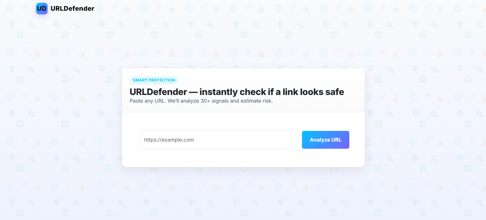

<div align="center">

# URLDefender – Instantly check if a link looks safe

Smart protection for suspicious links. Paste any URL — we analyze 30+ signals and estimate risk.



</div>

---

## Table of Contents
- [Features](#features)
- [Requirements](#requirements)
- [Installation](#installation)
- [Run Locally](#run-locally)
- [How It Works](#how-it-works)
- [Project Structure](#project-structure)
- [Troubleshooting](#troubleshooting)
- [License](#license)

## Features
- **Real-time analysis** of 30+ lexical, host, and metadata signals
- **Probability output**: safe vs. phishing confidence
- **Lightweight Flask UI** for quick manual checks
- **Pretrained model** bundled in `pickle/model.pkl`

## Requirements
- Python 3.10 recommended
- pip

## Installation
```powershell
# Windows PowerShell
py -3.10 -m venv .venv
.\.venv\Scripts\Activate.ps1
python -m pip install --upgrade pip
python -m pip install -r requirements.txt
```

## Run Locally
```powershell
python app.py
```
Then open http://127.0.0.1:5000/ and paste a URL to analyze.

## How It Works
- `feature.py` extracts 30 features from the input URL
- The model (`scikit-learn` Gradient Boosting) predicts and returns class probabilities
- The UI displays a simple confidence score for safe vs. phishing

## Project Structure
```
├── assets/
│   └── hero.png
├── pickle/
│   └── model.pkl
├── static/
│   └── styles.css
├── templates/
│   └── index.html
├── app.py
├── feature.py
├── phishing.csv
├── requirements.txt
└── README.md
```

## Troubleshooting
- If you see `ModuleNotFoundError: sklearn.ensemble._gb_losses` when loading the model, ensure you install the pinned versions from `requirements.txt` inside a Python 3.10 virtual environment and use `python -m pip`.

## License
This project is provided for educational purposes. You may adapt and use it in your own projects; please add attribution if you publish derivative work.
